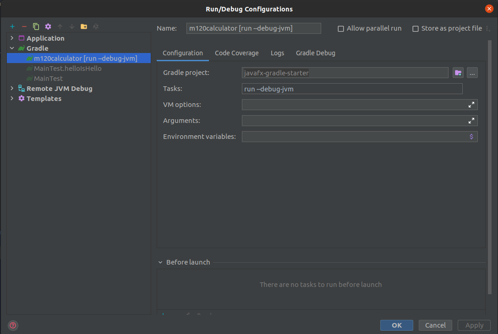
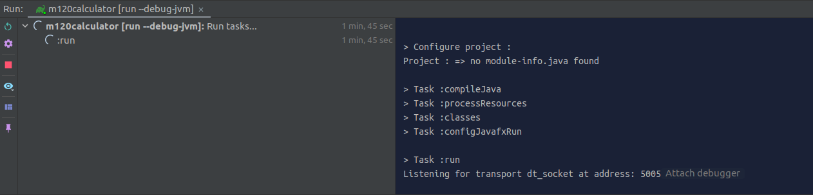

# javafx-gradle

A minimal JavaFX Gradle project. It uses the org.openjfx.javafxplugin to automatically install JavaFX.

Java version: 14

## Starting

Running:
`gradle run`

Debugging: `gradle run --debug-jvm`. The debugger will wait for a connection on port 5005.

IntellIJ should automatically notice the started debug session, and give you the option to attach a debugger.

Packaging:
`./gradle shadowJar`

学习网站：
https://openjfx.io

